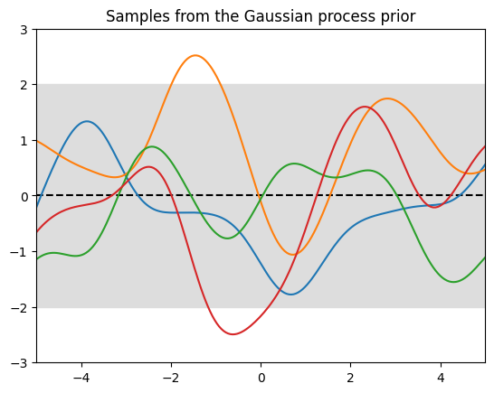
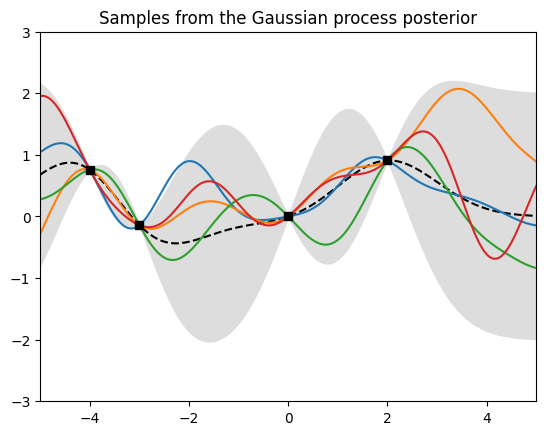

# Gaussian Process Playground

A simple example of implementing and plotting a Gaussian process. The user can explore the effect of different kernels and training sets on the prior and posterior distributions.




The colored solid lines are random draws from the process, the dashed black line is the mean, and the gray band is the 95% confidence interval. The black squares are the training points in the second image. 

## Requirements 

Numpy, and optionally Matplotlib for plotting.

## Usage

The notebook can be run as is. Feel free to edit the inputs in the **Test Bench** section of the Jupyter notebook to play around with different configurations.


The main function is 
```py
get_posterior(X_train, y_train, X_test)
``` 
which takes arbitrary training data and test points, and outputs the posterior mean and covariance of the Gaussian process. Optional parameters let you change the kernel and the amount of training noise. You can then input the means and coviariances into
```py
plot_gp(X_test, mean, cov)
```
to plot the predictive distribution, as shown above.

## Acknowledgements

Some of this code was motivated by this [blog post](https://katbailey.github.io/post/gaussian-processes-for-dummies/). 
